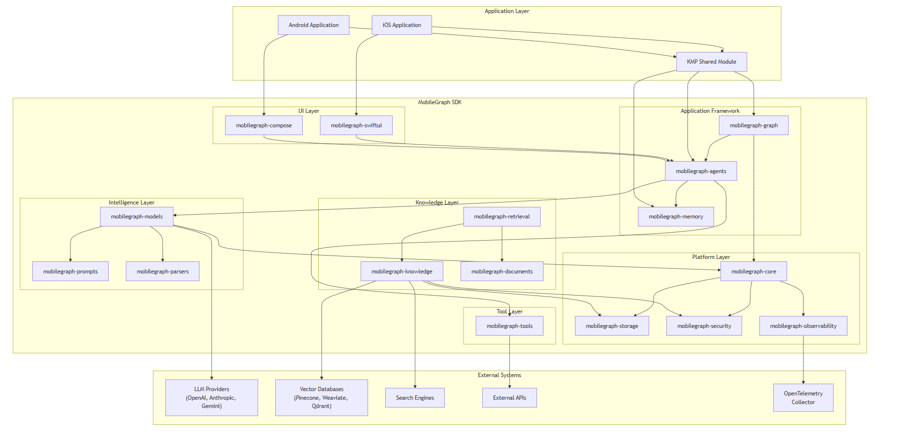

# MobileGraph Architecture

## Purpose

This document defines the architecture of MobileGraph.

It serves as the long-term architectural reference for the framework and provides guidance for contributors, maintainers, and AI coding agents.

Implementation details may evolve.

Architectural principles should remain stable.

---

# High-Level Architecture

MobileGraph is a Kotlin Multiplatform AI Application Framework inspired by the architectural principles of LangChain and LangGraph.

The framework is composed of independent modules organized into layers.

```text
UI Layer
↓
Agent Runtime Layer
↓
Intelligence Layer
↓
Knowledge Layer
↓
Foundation Layer
```

Dependencies flow downward only.

Reverse dependencies are forbidden.

---

# Architectural Principles

The architecture is guided by the following principles:

* Strong typing first
* Provider agnostic design
* Composition over inheritance
* Explicit over magic
* Observability by default
* Mobile-first execution
* Lifecycle awareness
* Progressive complexity
* Backward compatibility

---

# Layered Architecture

## Layer 1 – Foundation

Provides runtime infrastructure.

Modules:

```text
mobilegraph-core
mobilegraph-storage
mobilegraph-security
mobilegraph-observability
```

Responsibilities:

* Execution context
* Cancellation
* Middleware
* Exceptions
* Lifecycle state
* Capabilities
* Tracing
* Persistence abstractions

No module in this layer may depend on higher layers.

---

## Layer 2 – Knowledge

Provides data and memory capabilities.

Modules:

```text
mobilegraph-documents
mobilegraph-stores
mobilegraph-retrieval
mobilegraph-memory
```

Responsibilities:

* Document models
* Chunking
* Vector stores
* Retrieval
* Memory abstractions

Knowledge modules may depend only on Foundation modules.

---

## Layer 3 – Intelligence

Provides model interaction.

Modules:

```text
mobilegraph-models
mobilegraph-prompts
mobilegraph-parsers
mobilegraph-tools
```

Responsibilities:

* LLM abstraction
* Prompt templates
* Structured outputs
* Tool execution

Intelligence modules may depend only on Foundation and Knowledge layers.

---

## Layer 4 – Agent Runtime

Provides orchestration capabilities.

Modules:

```text
mobilegraph-agents
mobilegraph-graph
```

Responsibilities:

* Agents
* Workflow execution
* Checkpointing
* Multi-agent systems

Agent modules may depend on all lower layers.

---

## Layer 5 – UI Layer

Provides UI integration.

Modules:

```text
mobilegraph-compose
mobilegraph-swiftui
```

Responsibilities:

* State binding
* Streaming integration
* UI adapters

UI modules may depend on lower layers.

---

# Dependency Rules

Allowed:

```text
Graph → Agents

Agents → Tools

Agents → Models

Retrieval → Stores

Prompts → Core
```

Forbidden:

```text
Models → Agents

Core → Graph

Tools → Agents

Stores → Models

Prompts → Models
```

Circular dependencies are prohibited.

---

# Runtime Architecture

Execution is based on:

* Coroutines
* Structured concurrency
* Flow<T>

Flow<T> is the only streaming primitive used by MobileGraph.

Callbacks and observer APIs are discouraged.

---

# ExecutionContext

Every operation receives an ExecutionContext.

ExecutionContext carries:

* traceId
* sessionId
* requestId
* metadata
* locale
* deadline
* cancellationToken

ExecutionContext propagates automatically across layers.

Components must enrich existing context rather than create new contexts.

---

# Capability System

Provider-specific behavior is abstracted using capabilities.

Examples:

```kotlin
Capability.Streaming

Capability.FunctionCalling

Capability.StructuredOutput

Capability.Vision
```

Application code should never rely on provider implementations.

Avoid:

```kotlin
if (model is OpenAIChatModel)
```

Prefer:

```kotlin
model.supports(
    Capability.FunctionCalling
)
```

---

# Middleware Architecture

Cross-cutting concerns are implemented using middleware.

Examples:

* Retry
* Metrics
* Tracing
* Rate limiting
* Caching

Middleware order must be deterministic.

Middleware must not change business semantics.

---

# State Architecture

State is:

* immutable
* serializable
* replayable
* versioned

Nodes do not mutate shared state.

Instead:

```text
State S
+
Node N
↓
State S'
```

State transitions are observable.

Checkpointing and recovery are first-class capabilities.

---

# Error Model

Errors are typed.

Avoid generic exceptions.

Use:

```text
MobileGraphException
```

Subtypes:

```text
ConfigurationException

ExecutionException

TimeoutException

CancellationException
```

Recoverable operations should prefer Result<T>.

---

# Lifecycle Awareness

MobileGraph is mobile-first.

Execution must adapt to:

```text
Foreground

Background

Offline

Suspended

Killed

Restored
```

Lifecycle events are runtime events, not UI events.

---

# Extension Model

MobileGraph supports extension through interfaces.

Examples:

* ModelProvider
* ToolProvider
* RetrieverProvider
* Middleware

Reflection-based plugins are discouraged.

---

# Module Independence

Modules should:

* have a single responsibility
* expose stable APIs
* hide implementation details

Modules should evolve independently.

---

# Architectural Laws

1. Dependencies flow downward.
2. Flow<T> is the only streaming primitive.
3. ExecutionContext is universal.
4. Capabilities replace provider checks.
5. State is immutable.
6. Middleware order is deterministic.
7. Errors are typed.
8. Execution must be resumable.
9. Observability must be passive.
10. Core must remain dependency-free.

---

# Current Scope

Current implementation milestone:

```text
mobilegraph-core
mobilegraph-models
mobilegraph-prompts
mobilegraph-parsers
mobilegraph-tools
```

The following modules are not part of the current milestone:

```text
mobilegraph-memory

mobilegraph-retrieval

mobilegraph-agents

mobilegraph-graph

mobilegraph-compose

mobilegraph-swiftui
```

---

# Long-Term Vision

MobileGraph aims to provide a unified runtime across:

* Android
* iOS
* Edge devices

allowing workflows and agents to be reused across environments.

Implementation may change.

Architectural principles should endure.




