# MobileGraph Architecture

## Purpose

This document defines the architecture of MobileGraph.

It serves as the long-term architectural reference for the framework and provides guidance for contributors, maintainers, and AI coding agents.

Implementation details may evolve.

Architectural principles should remain stable.

---

# High-Level Architecture

MobileGraph is a Kotlin Multiplatform AI Application Framework inspired by the architectural principles of LangChain and LangGraph.

The framework is composed of independent modules organized into layers.

Dependencies flow downward only. Reverse dependencies are forbidden.

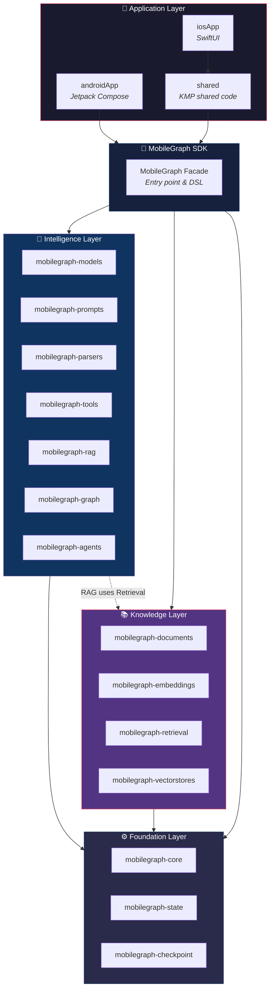


---

# Architectural Principles

The architecture is guided by the following principles:

* **Strong typing first** — Leverage Kotlin's type system to catch errors at compile time.
* **Provider agnostic design** — Application code should never depend on specific model providers.
* **Composition over inheritance** — Assemble behavior from small interfaces and middleware.
* **Explicit over magic** — Prefer explicit DSL configuration over convention-based auto-discovery.
* **Observability by default** — Every operation emits events through `EventPublisher`.
* **Mobile-first execution** — Respect lifecycle, memory, and battery constraints.
* **Lifecycle awareness** — Execution must adapt to foreground, background, suspended, and restored states.
* **Progressive complexity** — Simple use-cases should require minimal code; advanced patterns are opt-in.
* **Backward compatibility** — Public API surfaces must remain stable across minor versions.

---

# Layered Architecture

## Layer 1 — Foundation

Provides runtime infrastructure. No module in this layer may depend on higher layers.

### Modules

| Module | Responsibility | Key Types |
|---|---|---|
| `mobilegraph-core` | Runtime kernel, sessions, events, middleware, execution context, DI | `MobileGraph`, `MobileGraphSession`, `ExecutionContext`, `Middleware<I,O>`, `EventPublisher`, `MobileGraphEvent` |
| `mobilegraph-state` | Graph state container | `GraphState` (mutable key-value map) |
| `mobilegraph-checkpoint` | Snapshot and restore graph state | `CheckpointStore`, `InMemoryCheckpointStore` |

### Core Internal Architecture

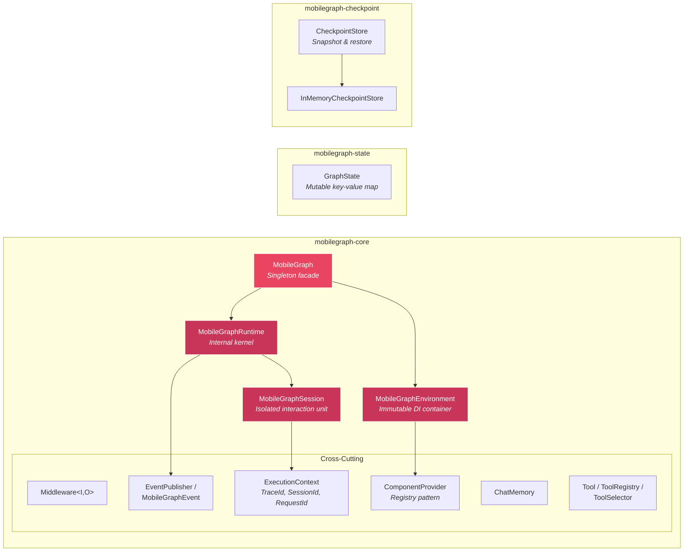

### Responsibilities

* Execution context and propagation
* Cancellation (via `CancellationToken`)
* Middleware pipeline
* Typed exceptions (`MobileGraphException`)
* Lifecycle state management
* Capability system
* Tracing and observability
* Session isolation

---

## Layer 2 — Knowledge

Provides data ingestion, storage, and retrieval capabilities. Knowledge modules may depend only on Foundation modules.

### Modules

| Module | Responsibility | Key Types |
|---|---|---|
| `mobilegraph-documents` | Document loading and text splitting | `Document`, `DocumentLoader`, `TextSplitter` |
| `mobilegraph-embeddings` | Model-agnostic embedding facade | Embedding access layer |
| `mobilegraph-vectorstores` | Vector persistence and similarity search | `VectorStore`, `SQLiteVectorStore`, `InMemoryVectorStore`, `VectorStoreRegistry` |
| `mobilegraph-retrieval` | Multi-strategy retrieval | `Retriever`, `BM25Retriever`, `HybridRetriever`, `MultiQueryRetriever`, `VectorStoreRetriever` |

### Knowledge Layer Architecture

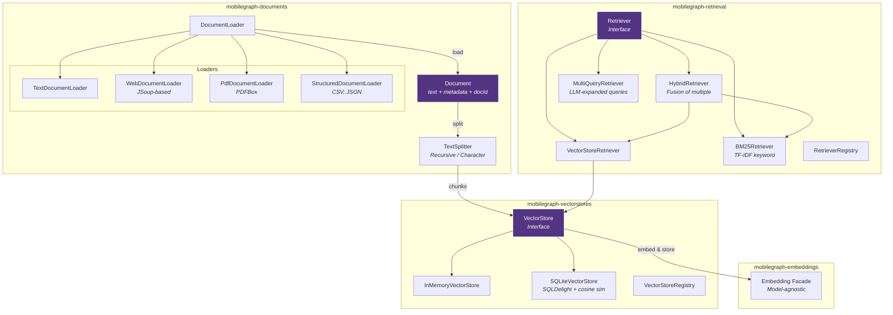

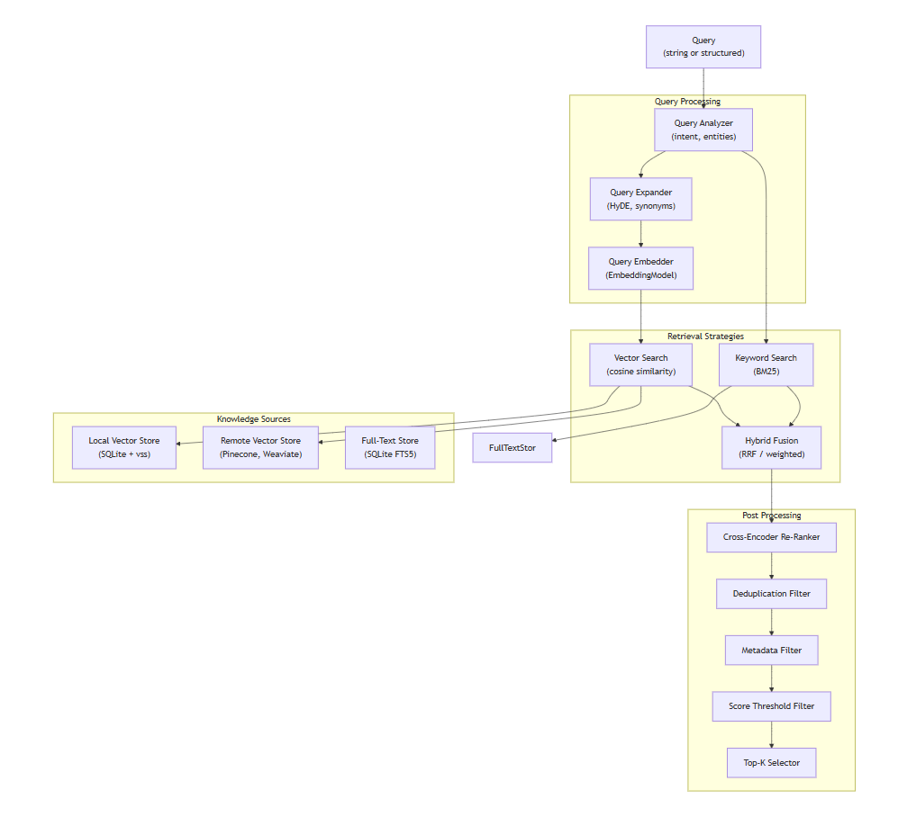

---

## Layer 3 — Intelligence

Provides model interaction, prompt engineering, output parsing, tool calling, and RAG orchestration. Intelligence modules may depend on Foundation and Knowledge layers.

### Modules

| Module | Responsibility | Key Types |
|---|---|---|
| `mobilegraph-models` | LLM abstraction + 7 provider integrations + middleware implementations | `ChatModel`, `StreamingChatModel`, `EmbeddingModel`, `ModelRegistry`, `ModelRouter` |
| `mobilegraph-prompts` | Prompt templates and composition DSL | `PromptTemplate`, `PromptComposer`, `PromptRegistry` |
| `mobilegraph-parsers` | Structured output parsing | `Parser<T>`, `StructuredOutputParser`, `ParseResult` (Success / Failure / Partial) |
| `mobilegraph-tools` | Tool registry and smart selection | `SemanticToolSelector`, `AllToolSelector`, `JsonEmbeddingStore` |
| `mobilegraph-rag` | RAG pipeline orchestration | `RagPipeline`, `SimpleRagPipeline`, `ContextBasedPromptBuilder` |

### Models Module Architecture

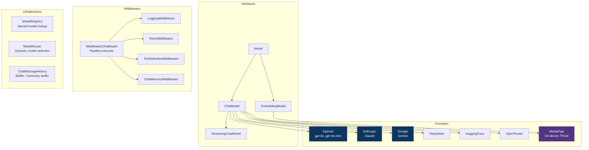

### Prompts, Parsers & Tools

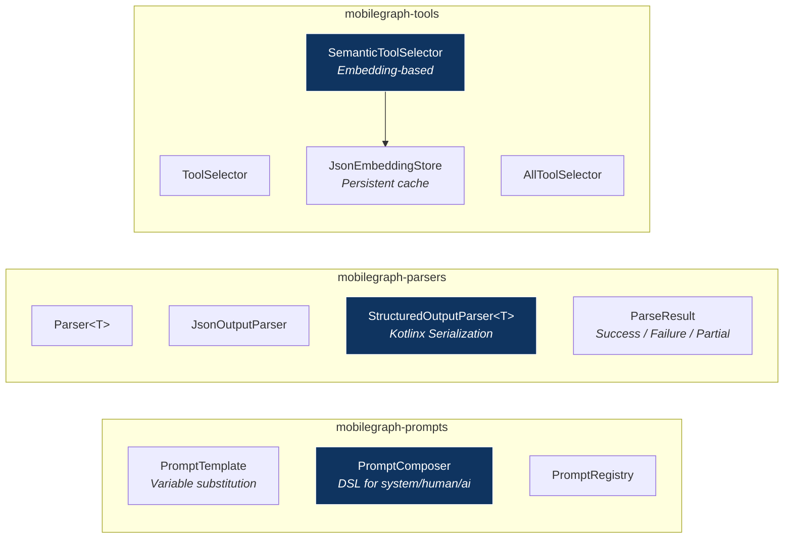

---

## Layer 4 — Agent Runtime

Provides orchestration capabilities. Agent modules may depend on all lower layers.

### Modules

| Module | Responsibility | Key Types |
|---|---|---|
| `mobilegraph-graph` | Directed state graph execution engine | `StateGraph`, `GraphNode`, `GraphEdge`, `ExecutionEngine`, `HumanReviewNode`, `JoinNode`, `EndNode` |
| `mobilegraph-agents` | Agentic loop combining model + tools + graph | `Agent`, `AgentNode`, `AgentRuntime`, `DefaultAgentRuntime` |

### Graph Engine & Agents Architecture

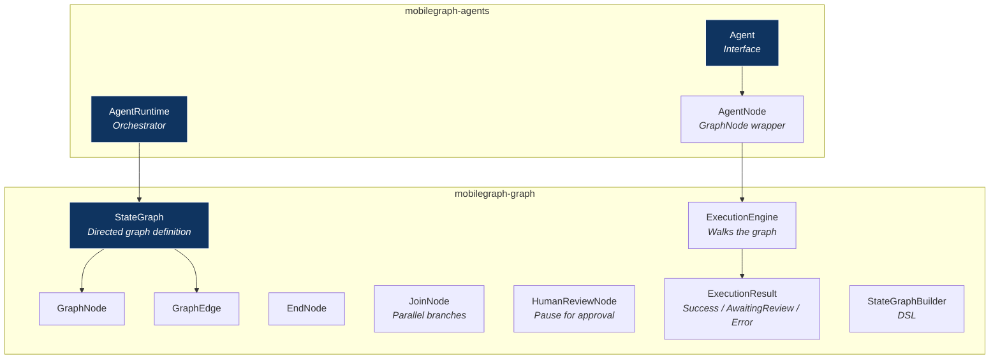

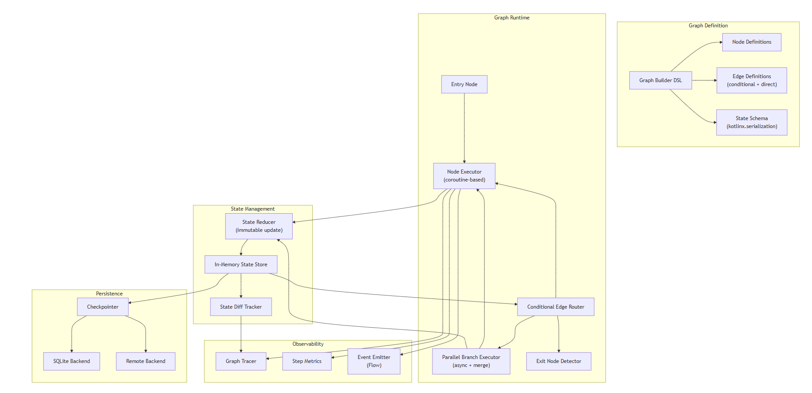

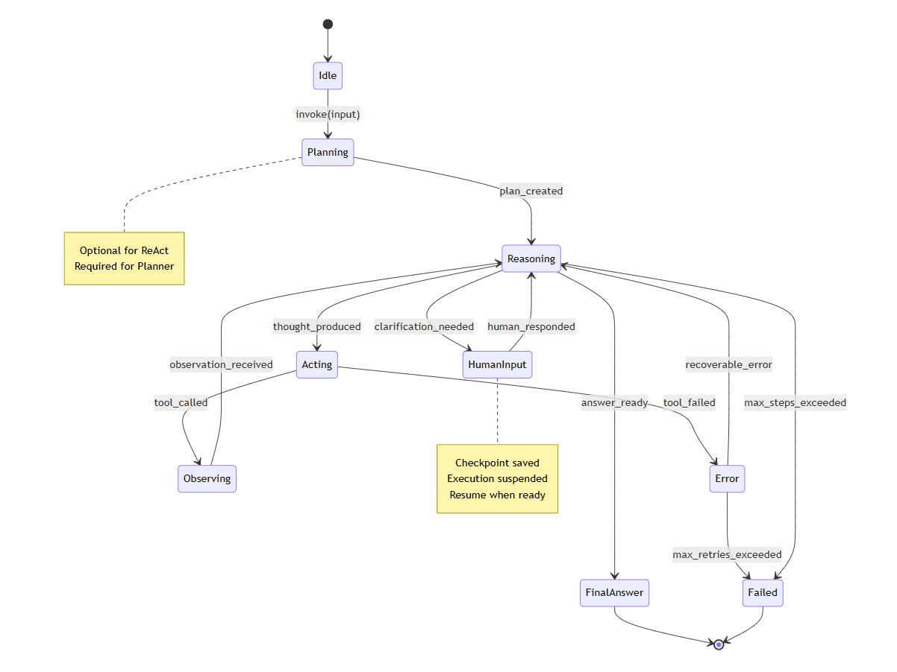

---

## Layer 5 — Application / UI Layer

Platform-specific applications that consume the SDK.

| Module | Platform | Technology |
|---|---|---|
| `androidApp` | Android | Jetpack Compose |
| `iosApp` | iOS | SwiftUI |
| `shared` | Cross-platform | KMP shared module |

UI modules may depend on all lower layers.

---

# Module Dependency Graph

This diagram shows the actual Gradle dependency edges between all modules (derived from `build.gradle.kts` files).

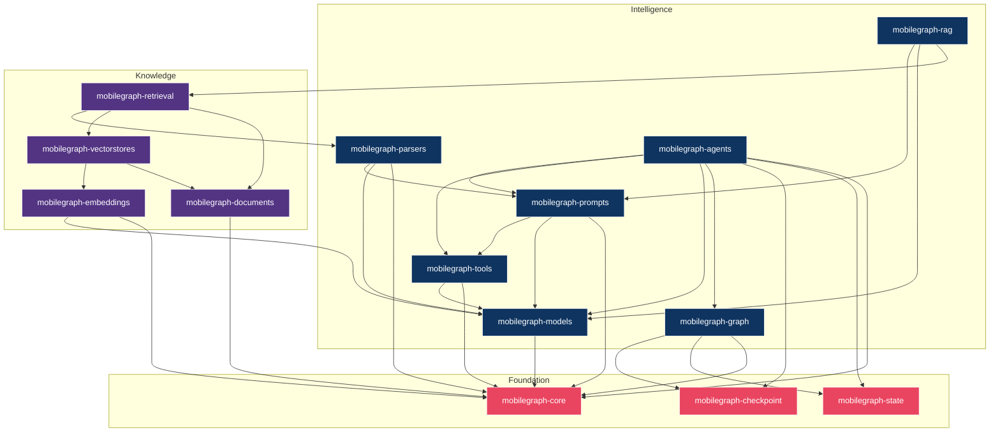

### Dependency Rules

**Allowed:**

* Agent Runtime → Intelligence, Knowledge, Foundation
* Intelligence → Knowledge, Foundation
* Knowledge → Foundation
* RAG → Retrieval (bridge between Intelligence and Knowledge)

**Forbidden:**

* Foundation → any higher layer
* Knowledge → Intelligence (except via embeddings → models)
* Circular dependencies of any kind

---

# Runtime Architecture

Execution is based on:

* **Kotlinx Coroutines** — structured concurrency for all async operations
* **Flow<T>** — the only streaming primitive (no callbacks or observer APIs)
* **SupervisorJob** — fault isolation between sessions

```mermaid
graph LR
    REQ["ChatRequest"]
    LOG["1. LoggingMiddleware<br/><i>Traces requests</i>"]
    RETRY["2. RetryMiddleware<br/><i>Exponential backoff</i>"]
    TOOL["3. ToolSelectionMiddleware<br/><i>Selects relevant tools</i>"]
    MEM["4. ChatMemoryMiddleware<br/><i>Injects history</i>"]
    MODEL["ChatModel.invoke()"]
    RESP["ModelOutput"]

    REQ --> LOG --> RETRY --> TOOL --> MEM --> MODEL --> RESP

    style REQ fill:#1a1a2e,stroke:#e94560,color:#fff
    style RESP fill:#1a1a2e,stroke:#e94560,color:#fff
    style MODEL fill:#0f3460,stroke:#fff,color:#fff
```

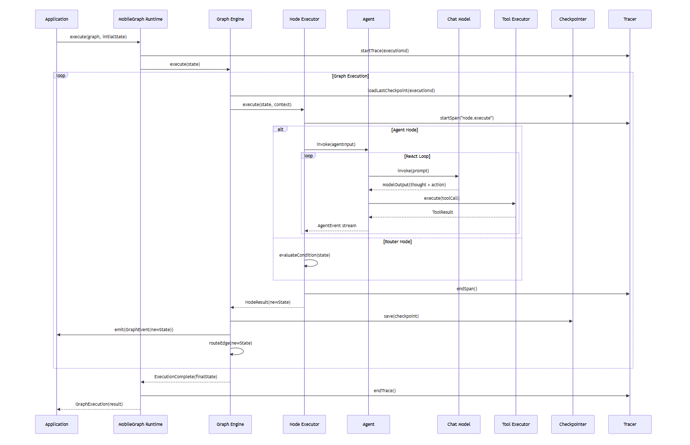

---

# ExecutionContext

Every operation receives an `ExecutionContext`.

ExecutionContext carries:

| Field | Type | Purpose |
|---|---|---|
| `traceId` | `TraceId` | End-to-end trace correlation |
| `sessionId` | `SessionId` | Session isolation |
| `requestId` | `RequestId` | Per-request identification |
| `metadata` | `Metadata` | Extensible key-value metadata |
| `locale` | `String?` | User locale for localized responses |
| `deadline` | `Long?` | Timeout deadline |
| `cancellationToken` | `CancellationToken` | Cooperative cancellation |

ExecutionContext propagates automatically across layers. Components must enrich existing context rather than create new contexts.

---

# RAG Pipeline — End-to-End Flow

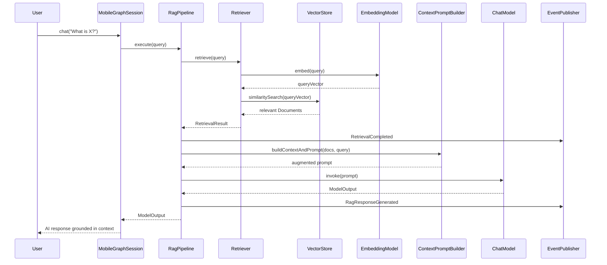

---

# Capability System

Provider-specific behavior is abstracted using capabilities.

Examples:

```kotlin
Capability.Streaming
Capability.FunctionCalling
Capability.StructuredOutput
Capability.Vision
```

Application code should never rely on provider implementations.

Avoid:

```kotlin
if (model is OpenAIChatModel) // ❌
```

Prefer:

```kotlin
model.supports(Capability.FunctionCalling) // ✅
```

---

# Middleware Architecture

Cross-cutting concerns are implemented using the `Middleware<I, O>` interface:

```kotlin
interface Middleware<I, O> {
    suspend fun intercept(
        input: I,
        context: ExecutionContext,
        next: suspend (I, ExecutionContext) -> O,
    ): O
}
```

**Built-in middleware:**

| Middleware | Purpose |
|---|---|
| `LoggingMiddleware` | Traces requests and responses |
| `RetryMiddleware` | Exponential backoff with configurable retries |
| `ToolSelectionMiddleware` | Selects relevant tools for the request |
| `ChatMemoryMiddleware` | Injects conversation history into prompts |

Middleware order must be deterministic. Middleware must not change business semantics.

---

# State Architecture

State is:

* Immutable (nodes produce new state, never mutate)
* Serializable
* Replayable
* Versioned

```text
State S  +  Node N  →  State S'
```

State transitions are observable. Checkpointing and recovery are first-class capabilities.

---

# Error Model

Errors are typed. Avoid generic exceptions.

```text
MobileGraphException
├── ConfigurationException
├── ExecutionException
├── TimeoutException
└── CancellationException
```

Recoverable operations should prefer `Result<T>`.

---

# Lifecycle Awareness

MobileGraph is mobile-first. Execution must adapt to:

| State | Behavior |
|---|---|
| Foreground | Full execution |
| Background | Reduced priority, respect battery |
| Offline | On-device models only (e.g., MediaPipe) |
| Suspended | Checkpoint and pause |
| Killed | Clean resource release |
| Restored | Resume from checkpoint |

Lifecycle events are runtime events, not UI events.

---

# Platform Architecture

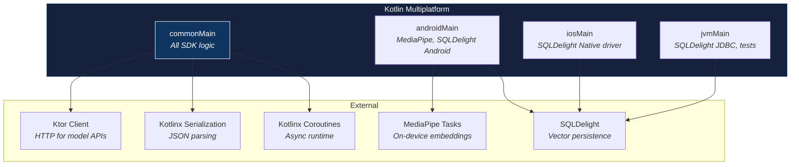

---

# Extension Model

MobileGraph supports extension through interfaces:

* `ChatModel` / `StreamingChatModel` — custom model providers
* `EmbeddingModel` — custom embedding providers
* `Tool<I, O>` — custom tool implementations
* `Retriever` — custom retrieval strategies
* `VectorStore` — custom vector storage backends
* `Middleware<I, O>` — custom cross-cutting concerns
* `DocumentLoader` — custom document ingestion
* `Agent` — custom agentic workflows

Reflection-based plugins are discouraged. Prefer explicit registration via DSL.

---

# Key Design Patterns

| Pattern | Where | Purpose |
|---|---|---|
| **Singleton Facade** | `MobileGraph` | Single entry point, DSL initialization |
| **Builder / DSL** | `MobileGraphEnvironment.Builder`, `withModels {}`, `withTools {}` | Fluent configuration |
| **Session Isolation** | `MobileGraphSession` | Each session has its own history, model binding, and event stream |
| **Middleware Chain** | `Middleware<I,O>`, `MiddlewareChatModel` | Cross-cutting concerns (logging, retry, memory, tool selection) |
| **Registry** | `ModelRegistry`, `ToolRegistry`, `RetrieverRegistry`, `VectorStoreRegistry` | Named component lookup with defaults |
| **Strategy** | `Retriever`, `ToolSelector`, `ChatModel`, `EmbeddingModel` | Swappable implementations behind interfaces |
| **Event Bus** | `EventPublisher` → `SharedFlow<MobileGraphEvent>` | Decoupled observability |
| **State Graph** | `StateGraph`, `GraphNode`, `GraphEdge` | LangGraph-style directed workflow execution |
| **Component Provider** | `MobileGraphEnvironment.getComponent<T>()` | Type-safe service locator |

---

# Module Independence

Modules should:

* Have a single responsibility
* Expose stable APIs
* Hide implementation details

Modules should evolve independently.

---

# Architectural Laws

1. Dependencies flow downward.
2. `Flow<T>` is the only streaming primitive.
3. `ExecutionContext` is universal.
4. Capabilities replace provider checks.
5. State is immutable.
6. Middleware order is deterministic.
7. Errors are typed.
8. Execution must be resumable.
9. Observability must be passive.
10. Core must remain dependency-free.

---

# Module Summary Table

| Layer | Module | Responsibility | Key Types |
|---|---|---|---|
| **Foundation** | `mobilegraph-core` | Runtime, sessions, events, middleware, context, DI | `MobileGraph`, `MobileGraphSession`, `ExecutionContext`, `Middleware` |
| | `mobilegraph-state` | Graph state container | `GraphState` |
| | `mobilegraph-checkpoint` | Snapshot & restore graph state | `CheckpointStore`, `InMemoryCheckpointStore` |
| **Intelligence** | `mobilegraph-models` | Model abstraction + 7 providers + middleware | `ChatModel`, `EmbeddingModel`, `ModelRegistry`, `RetryMiddleware` |
| | `mobilegraph-prompts` | Prompt templates, composition DSL | `PromptTemplate`, `PromptComposer`, `PromptRegistry` |
| | `mobilegraph-parsers` | Structured output parsing | `Parser<T>`, `StructuredOutputParser`, `ParseResult` |
| | `mobilegraph-tools` | Tool registry & smart selection | `SemanticToolSelector`, `AllToolSelector`, `JsonEmbeddingStore` |
| | `mobilegraph-rag` | RAG pipeline orchestration | `RagPipeline`, `SimpleRagPipeline`, `ContextBasedPromptBuilder` |
| | `mobilegraph-graph` | Directed state graph engine | `StateGraph`, `GraphNode`, `ExecutionEngine`, `HumanReviewNode` |
| | `mobilegraph-agents` | Agentic loop (model + tools + graph) | `Agent`, `AgentNode`, `AgentRuntime` |
| **Knowledge** | `mobilegraph-documents` | Document loading & text splitting | `Document`, `TextSplitter`, `WebDocumentLoader`, `PdfDocumentLoader` |
| | `mobilegraph-embeddings` | Embedding facade | Model-agnostic embedding access |
| | `mobilegraph-vectorstores` | Vector persistence & similarity search | `VectorStore`, `SQLiteVectorStore`, `InMemoryVectorStore` |
| | `mobilegraph-retrieval` | Multi-strategy retrieval | `Retriever`, `BM25Retriever`, `HybridRetriever`, `MultiQueryRetriever` |

---

# Long-Term Vision

MobileGraph aims to provide a unified runtime across:

* Android
* iOS
* Edge devices

allowing workflows and agents to be reused across environments.

Implementation may change. Architectural principles should endure.

---

# Appendix — Static Architecture Diagrams

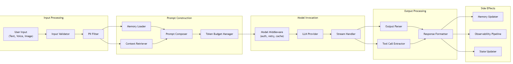

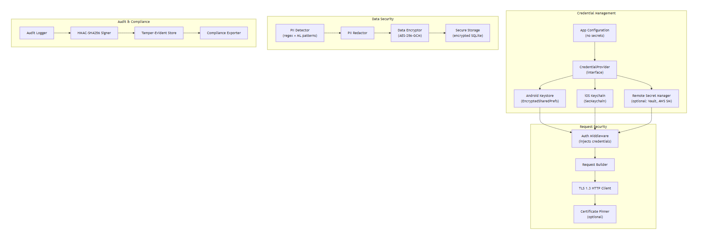